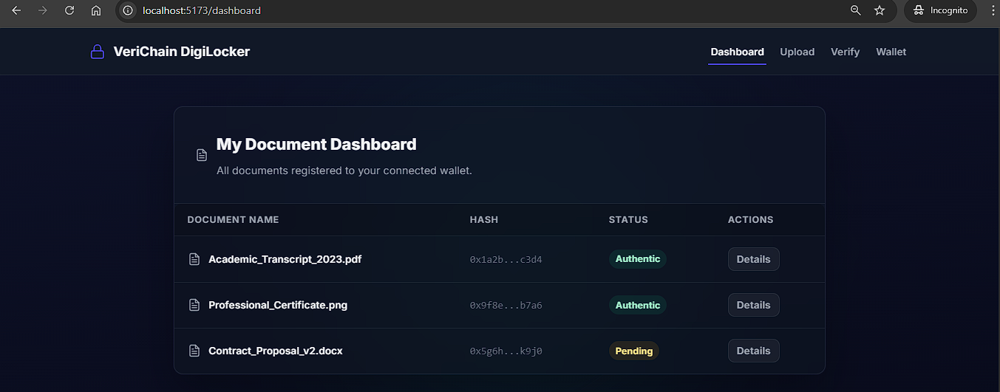
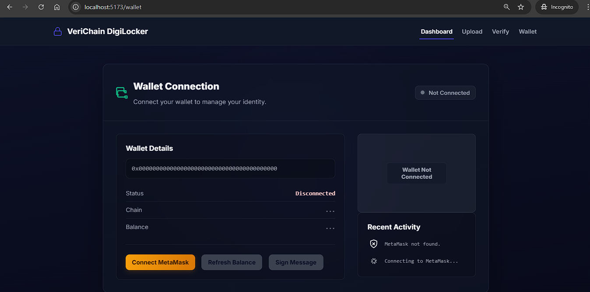
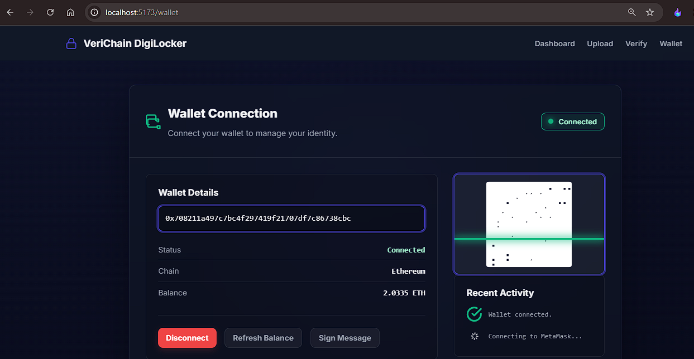
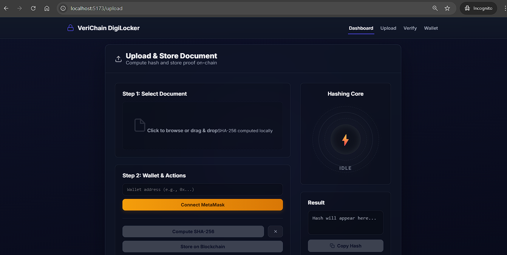
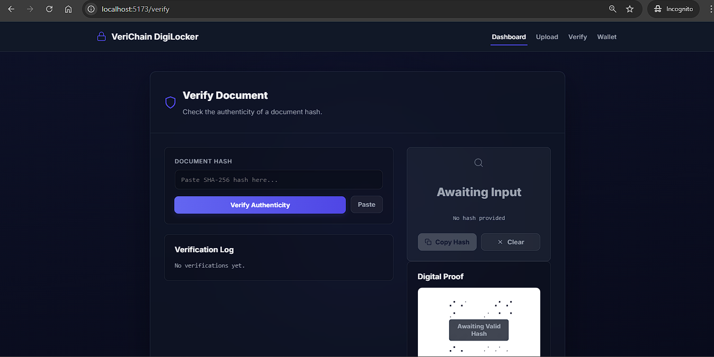
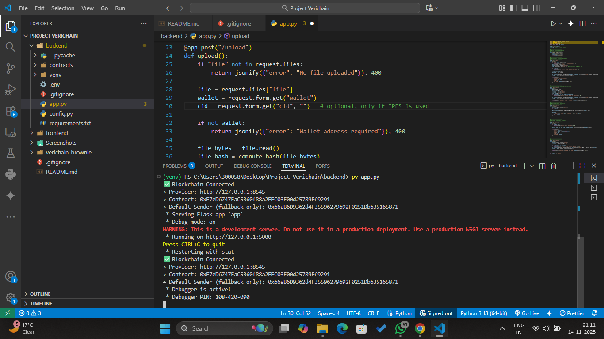
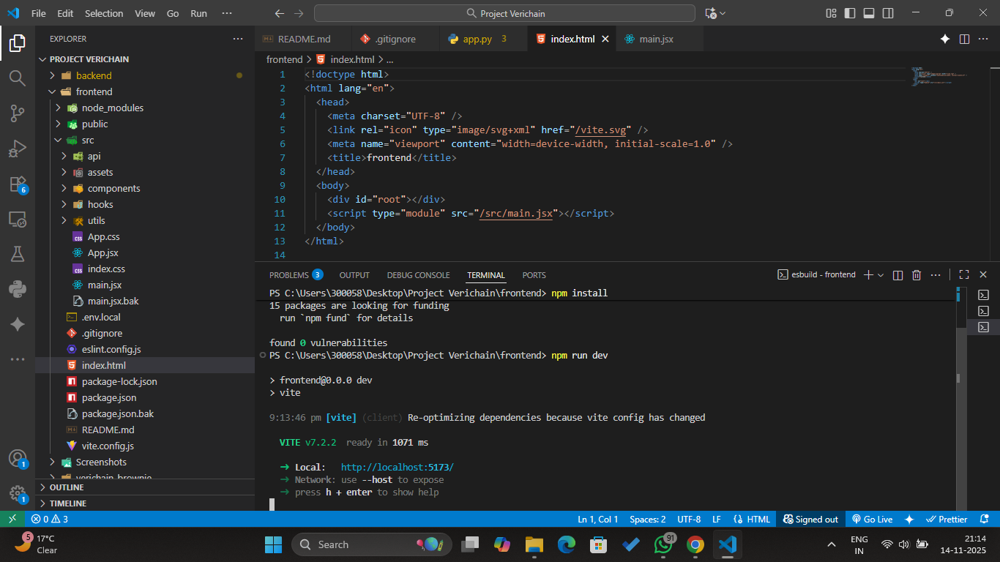

# VeriChain — Blockchain-Based Digital Locker

VeriChain is a secure, decentralized digital locker system for storing documents, generating immutable proofs, and verifying authenticity through blockchain.  
It uses a **Brownie Ethereum virtual environment**, a **Flask backend**, and a **Vite + React frontend**, along with a **Demo Mode** for quick testing.

---

## 🔧 Tech Stack & Architecture

| Component        | Tool / Framework | Port  | Notes                                   |
|------------------|------------------|-------|------------------------------------------|
| Smart Contracts  | Brownie          | 8545  | Must be started **first**               |
| Backend API      | Flask            | 5000  | Communicates with blockchain & frontend |
| Frontend UI      | Vite + React     | 5173  | User interface                           |
| Demo Mode        | Built-in         | —     | For quick testing without wallet         |

### Startup Order
1. **Start Brownie** (blockchain — 8545)  
2. **Start Flask backend** (server — 5000)  
3. **Start Vite frontend** (UI — 5173)  

---

## 📘 What is a Digital Locker?
A digital locker is an online platform for securely storing and accessing digital documents.  
It reduces physical document handling and prevents tampering or loss.

---

## 🔗 What is a Blockchain-Based Digital Locker?
A blockchain digital locker stores **document hashes** on a decentralized ledger, ensuring:

- Immutability  
- Tamper-proof verification  
- Decentralized ownership  
- Trustless validation  

Only the document **hash**, not the file, is stored on-chain.

---

## 🇮🇳 Digital Locker Used by Government of India
The Government of India provides **DigiLocker**, a centralized digital document repository for verified certificates such as Aadhaar, PAN, driving license, mark sheets, etc.

---

## ⭐ Why Use VeriChain?
- Decentralized and tamper-proof  
- No central authority  
- Fully open-source  
- Customizable for institutions  
- Works offline with local blockchain  
- Ideal for academic, enterprise, or startup use  

---

## 🔍 VeriChain vs DigiLocker

| Feature                       | VeriChain (This Project)                 | DigiLocker (Govt. of India)                       |
|-------------------------------|-------------------------------------------|--------------------------------------------------|
| Backend Model                | **Decentralized (Blockchain)**            | Centralized Government Servers                   |
| Document Storage             | Only **hash** stored on-chain             | Full documents stored by GoI                     |
| Verification                 | Trustless, cryptographic                  | Government-verified                              |
| Customization                | Fully customizable & open-source          | Closed-source                                    |
| Identity Requirement         | No mandatory KYC                          | Aadhaar-based login required                     |
| Document Ownership           | User-controlled                           | Govt-controlled issuance                         |
| Use Cases                    | Students, projects, private orgs          | Indian citizens, official certificates           |

---

# 🖼️ Screenshots

Below images are stored in `/Screenshots/` folder.

## **Home**

## **Dashboard**

## **Wallet**

## **File Upload Page**

## **Verify Document Page**

---

# 📟 Console Outputs

## **Brownie Blockchain Console (Port 8545)**

## **Flask Backend Console (Port 5000)**

## **Frontend Console (Port 5173)**

F
---

## 🚀 Features
- Blockchain-powered verification  
- Wallet integration  
- SHA-256 hashing  
- File upload + proof generation  
- On-chain validation  
- Demo mode  
- Simple & clean UI  
- Flask API + Brownie smart contracts  

---

## 📂 Project Structure
VeriChain/
│── backend/ # Flask API
│── contracts/ # Brownie smart contracts
│── frontend/ # React + Vite UI
│── Screenshot/ # App screenshots
│── README.md

---

## ▶️ How to Run

### 1. Start Blockchain
cd blockchain
venv/Scripts/activate
brownie run scripts/deploy.py

### 2. Start Backend
cd backend
venv/Scripts/activate
python app.py

### 3. Start Frontend
cd frontend
npm install
npm run dev

---

## 📄 Project Information

**GitHub Repository:**  
https://github.com/UraniumUtkarsh/VeriChain

**Project Authors (SRMU):**  
- utkarshpandey_202210101180005@srmu.ac.in  
- prakhargupta_202210101180003@srmu.ac.in  
- ashutoshpatel_202210101190003@srmu.ac.in  

---

## ⚠️ License Status

This project **currently does not have any open-source license issued**.  
VeriChain is developed **strictly as a course-based academic project**, and redistribution or reuse outside educational evaluation is not permitted at this stage.

A formal license may be added in the future if the project evolves beyond coursework.

